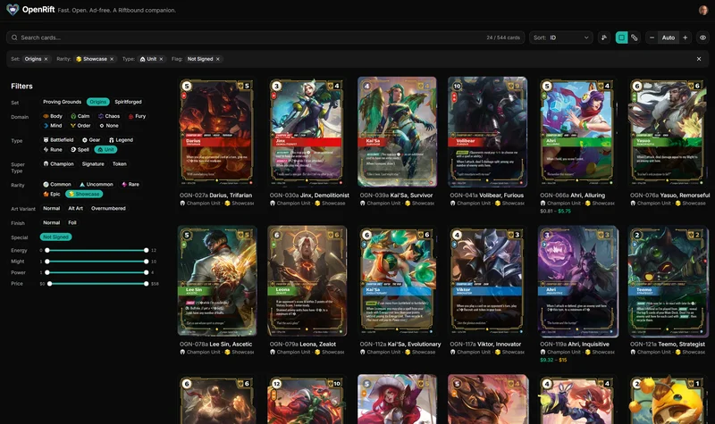

# OpenRift

_Built with Fury. Maintained with Calm._

An open-source, [actively developed](apps/web/src/CHANGELOG.md) companion app for [Riftbound](https://riftbound.leagueoflegends.com/), League of Legends' trading card game. Track your collection, build decks, trade, and more.

Live and free to use at **[openrift.app](https://openrift.app)**, no install required. This repository is the code that runs it.

## What it does

- **Comprehensive catalog.** More cards and printings than anywhere else. Almost all English cards and promos, plus many Chinese cards. French isn't in yet, unfortunately.
- **Accurate price tracking.** Daily prices from TCGplayer, Cardmarket, and CardTrader, side by side, with history charts.
- **One card, one place.** Collections map to the real world: a deck box, a binder, a card lent to a friend. Each copy lives in exactly one, so the app always mirrors what's actually on your shelf.
- **Wishlists and tradelists.** Track the cards you want and the spares you'd part with, and share either by link with anyone. Lists can also fill themselves from rules (a playset of every card, every surplus common beyond two playsets) and stay current on their own.
- **Private groups.** Form a small group with friends or your local game store, with collections owned by the whole group, a view into each member's own collections, and trade matching that surfaces who has the cards you're after. No other Riftbound site does this.
- **Your decks, your rules.** Validate against official and custom formats, or build freeform with no limits at all. Energy curves, deck codes, per-matchup plans, and a list of what you're still missing so you can proxy or buy the rest. Start building without signing in, and share a deck as a link that unfurls into a full visual decklist.
- **A full toolbox.** Pack opener, card designer, tournament tools, and a searchable rules reference are all built in with more to come.
- **Private and open.** Zero third-party trackers, just cookie-free Umami analytics. Open source under AGPL-3.0, with import and export options, so your data is never locked in.

There is plenty more on the public [roadmap](https://openrift.app/roadmap) and I like to get feedback about what would make this app even better for **you**.

## What it doesn't do

Some things are left out on purpose, each for a reason.

- **No ads**, because nobody has ever wished a page had more ads on it. If I ever monetize beyond donations and affiliate links, I promise it'll be in a way I'd be happy with as a user myself. The ideas I have in mind would **add** value rather than take anything away from you.
- **No forums**, because moderation is a full-time job I don't have time for.
- **No AI** deck suggestions, because as good as AI is at some things, deck-building today isn't one of them.

For where OpenRift stands against the alternatives, and what it has today versus what it doesn't, see the [honest comparison](https://openrift.app/help/why-openrift).

## Why

I wanted to track my collection, and nothing I tried fit. One site was missing cards, another felt slow on mobile and dropped cards mid-edit, a third had every feature on the planet but the basics didn't feel solid. And none of them worked really well on both desktop and mobile.

So naturally, after a full week of patient, rigorous evaluation, I did the only reasonable thing and built my own from scratch. One thing led to another, and four months in, it's grown into something quite nice that I use every day.

If you want to talk about OpenRift there's a [Discord](https://discord.gg/Qb6RcjXq6z).

## For developers

OpenRift is a TypeScript monorepo: a TanStack Start + shadcn/ui frontend (`apps/web`), a Hono API on Bun (`apps/api`), and PostgreSQL accessed through Kysely.

- [Architecture](docs/architecture.md) covers the monorepo structure, packages, and infrastructure.
- [Data Layer](docs/data-layer.md) documents the database schema and API endpoints.
- [Development](docs/development.md) lists the prerequisites, setup, and commands.
- [Deployment](docs/deployment.md) walks through VPS setup, Docker Compose, and CI/CD.
- [Contributing](docs/contributing.md) explains code style, conventions, and the changelog.

On the AI question: yes, Claude does a lot of the typing, so you might find a stray em dash here and there. That doesn't mean OpenRift is vibe-coded. The architecture and the decisions that matter are mine, and with 20+ years of full-stack experience behind it, I review and shape every part of the code.

Issues and pull requests are welcome. If you open a pull request, please make sure you understand the code you're submitting, since it's held to the same standard. To contribute card data rather than code, see [openrift-data](https://github.com/openriftapp/openrift-data).

## Legal

OpenRift is an unofficial fan project, not affiliated with or endorsed by Riot Games. Created under Riot's "Legal Jibber Jabber" policy using assets owned by Riot Games.

## License

[AGPL-3.0](LICENSE)

---

Made by Eiko Wagenknecht. I also build [LootScraper](https://github.com/eikowagenknecht/lootscraper).
